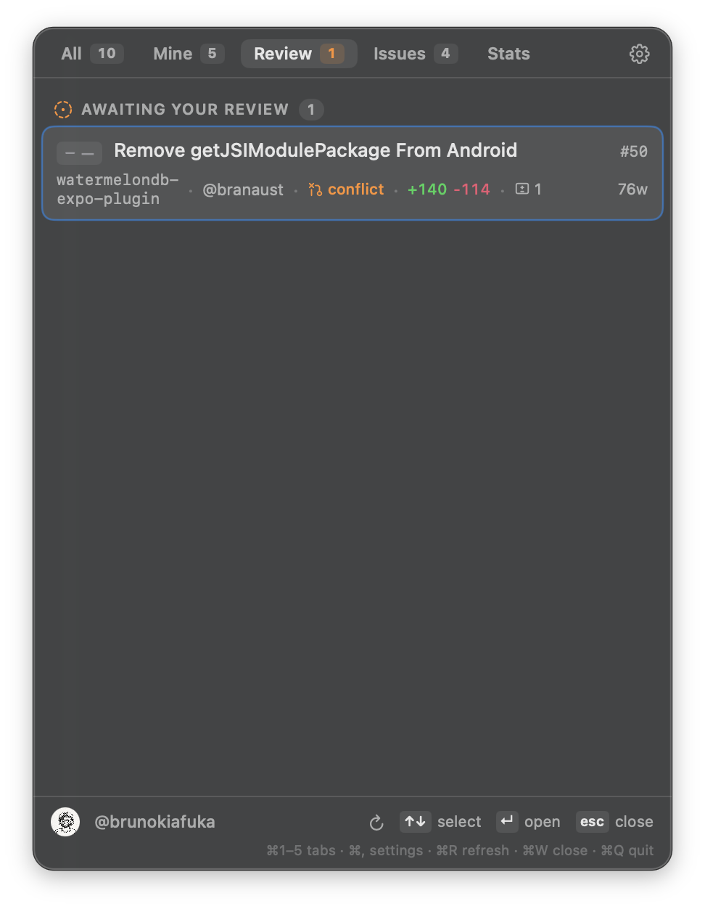

# gitbar

`gitbar` is a lightweight macOS menu bar app that helps you keep up with GitHub work without living in the browser.

Open it from the menu bar and quickly check:

- PRs you opened
- PRs waiting for your review
- issues assigned to you
- a simple stats snapshot

Click any row and it opens on GitHub right away.

## Screenshots

|                               Mine                               |                                Review                                 |                        Stats                        |
| :--------------------------------------------------------------: | :-------------------------------------------------------------------: | :-------------------------------------------------: |
|  |  |  |

## Quick start

### What you need

- macOS 14+
- a GitHub personal access token (see [Authentication](#authentication))

If you are building from source, also install Xcode Command Line Tools:

```bash
xcode-select --install
```

### Install with Homebrew (recommended)

```bash
brew tap brunokiafuka/gitbar https://github.com/brunokiafuka/gitbar
brew install gitbar
gitbar
```

That is it. `gitbar` launches the app.

### Install from source

```bash
git clone https://github.com/brunokiafuka/gitbar.git
cd gitbar
./install
open "$HOME/Applications/Gitbar.app"
```

The install script builds a release app and puts `Gitbar.app` in `~/Applications`.

## Authentication

### Create a token

Classic token (fastest path):

- Open [Create new token (classic)](https://github.com/settings/tokens/new?description=Gitbar&scopes=repo)
- Generate token
- Paste it into Gitbar Settings

Fine-grained token:

- Open [Create fine-grained token](https://github.com/settings/personal-access-tokens/new?name=Gitbar&description=Gitbar%20menu%20bar%20app)
- Choose repository access
- Set these permissions:
  - Pull requests: Read and write (merge)
  - Issues: Read
  - Metadata: Read
- Paste token into Gitbar Settings

## Roadmap

Current release is an MVP. Planned improvements:

- [ ] merge and mark-ready actions in-app
- [ ] failing CI section (check runs)
- [ ] historical stats over time (instead of current snapshot only)
